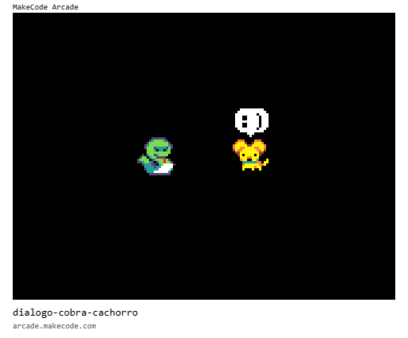

# [Trilha Python](index.md)

## Diálogo entre a cobra e o cachorro

Vamos escrever uma nova história. Desta vez vamos explorar o `tempo` para fazer o programa contar a história sozinho, sem precisarmos apertar um botão para a história avançar.

### Funções utilizadas

Já usamos estas funções antes:

- sprites.create(imagem, tipo)
- sprite.set_position(x, y)

Vamos acrescentar estas:

- pause(tempo)
- sprite.say_text(texto)

- sprite.set_scale(tamanho, ancoragem)
- sprite.set_velocity(vel_x, vel_y)
- game.game_over(booleano)

### Resultado
O resultado final vai ficar assim:

## [Voltar](index.md)