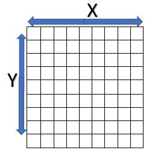

# [Trilha Python](index.md)

## Lógica de programação

Os programas de exemplo abaixo rodam em um ambiente de desenvolvimento chamado [MakeCode Arcade](https://arcade.makecode.com).

> `Para rodar`
>
> 1. Abra o link [https://arcade.makecode.com](https://arcade.makecode.com)
> 1. Arraste a imagem para a janela do *MakeCode*

## Desafio: Sprites e coordenadas

Um 'Sprite' é uma imagem que pode ser movida pela tela.

### Coordenadas

A posição na tela de um Sprite ou imagem é definida por um par de valores (`x`,`y`) chamado de "coordenadas".

Os valores de `x` iniciam em `0` (zero) e começam a ser contados da esquerda para a direita.

Os valores de `y` iniciam em `0` (zero) e são contados de cima para baixo.

### Problema

O *canto superior esquerdo* da tela tem coordenadas `(0, 0)`.

Quais são os os valores dos outros cantos?

Vamos investigar isso e encontrar a solução movendo um Sprite pela tela.

### Programa exemplo

A imagem da cobrinha tem 16x16 pixels.
Sua posição no início do progama é:

- x: 8
- y: 8

Agora que você posicionou a cobrinha no canto inferior direito da tela, responda:
 
**Quais os valores das coordenadas de todos os 4 cantos da tela?**

### [voltar](index.md)